# Introduction

This is the basis of my work, where I wrote down everything I planned for this project since the start of it. Keep in mind that I tried building everything that's written here in just 5 days, but things could have taken a different turn or not everything was completed in the first release.

# Story

## Intro

The year is 1943, we are in the middle of World War II. Our story's heroine is Martha, a 25 years old British pilot. She works for a secret agency, where she learned everything about battle planes to take undercover missions against german air forces. Two days ago, her father, a British general, was kidnapped by the Germans and is being held captive in their western stronghold.

Enraged at this news, Martha is on a mission to rescue her father by breaching each of the 5 main west command posts, where she will find clues on how to breach through the command post in which her father is located.

Now everything depends on you, the player, to guide her in this journey, but don't worry, the agency will help you with any means necessary each time you take down a post commander. Good luck!

## Chapter 1 (Weingut I)

Martha has arrived at the 1st command outpost.

Martha: "This is it, the beginning of my mission, I will never give up, I need to save him!"

** battle **

Philip (Boss): "How dare you invade my outpost? Who are you?"
Martha: "Where's him?"
Philip (Boss): "Who are you talking about? Get her!"

** BOSS battle **

Martha: "I guess he didn't know where my father is, but I found a note here!"

Note: "Find the giant"

Martha: "What does that mean?"

** bonus **

Nigel: "Martha, congratulations on destroying this outpost, the agency sent you a gift, please choose one of them:"

## Chapter 2 (Battery Moltke)

Martha has arrived at the 2nd command outpost.

Martha: "Let's keep on moving, hang in there, dad!"

** battle **

Karl (Boss): "Welcome, this will be the end, prepare yourself!"
Martha: "I'm ready to rumble!"

** BOSS battle **

Martha: "Tell me where he is now!"

Karl (Boss): "You won't get away with this, the seven must live!"

Martha: "What do you mean?"

Martha: "He's gone..."

** bonus **

Nigel: "Martha, congratulations on destroying this outpost, the agency sent you a gift, please choose one of them:"

## Chapter 3 (B8 Bergkristall)

Martha has arrived at the 3rd command outpost.

Martha: "It's only the beginning, let's move!"

** battle **

Robert (Boss): "Give up already, you won't get past me!"
Martha: "Don't flatter yourself, come on!"

** BOSS battle **

Martha: "This is the third one and I still got nothing. Huh, what's that written on the wall?"

Wall: "Your destiny is in the sleepless mountain"

Martha: "Hmmm"

** bonus **

Nigel: "Martha, congratulations on destroying this outpost, the agency sent you a gift, please choose one of them:"

## Chapter 4 (Siracourt V-1)

Martha has arrived at the 4th command outpost.

Martha: "Almost there, I must not fail!"

** battle **

Hermann (Boss): "This is the end of the road for you!"
Martha: "It is the end of the road, but not for me!"

** BOSS battle **

Martha: "What is that? A chest?"

** opens the chest **

Martha: "There's a toy castle inside, very curious."

** bonus **

Nigel: "Martha, congratulations on destroying this outpost, the agency sent you a gift, please choose one of them:"

## Chapter 5 (Wolf's Lair)

Martha has arrived at the 5th command outpost.

Martha: "This is the last command post, this must contain the final piece of the puzzle!"

** battle **

Heinrich (Boss): "You have finally arrived, let me give you a very warm welcome!"
Martha: "This is for my father, be gone!"

** BOSS battle **

Martha: "I have destroyed the last outpost and found nothing."

Martha: "Wait a minute, the clues must mean something."

Nigel: "That's right, Martha, put them together!"

Martha: "The sleepless mountain, it must be the Owl Mountains!"

Martha: "The toy castle, could it be Książ Castle?"

Nigel: "Yes, and I heard the Germans are building seven massive underground bases in that location!"

Martha: "Wait a minute, the 'Giant'! It must be Project Riese, that's where my father is! We must not waste time, let's go!"

** bonus **

Nigel: "Martha, congratulations on destroying this outpost, the agency sent you a gift, please choose one of them:"

## Chapter 6 (Project Riese)

Martha has arrived at the final command outpost.

Martha: "Dad, I'm coming, hang in there!"

** battle **

Adolf (Boss): "I can't believe you defeated my commanders!"
Martha: "Release my father and give up right now if you want to live."
Adolf (Boss): "Unfortunately for you, this fight won't be as easy as the previous ones!"

** BOSS battle **

Martha: "He's unconscious, I must find my father and leave as fast as possible."

Father: "Martha, in here!"

Martha: "I have finally found you, come on, we don't have much time!"

** huge explosion **

Martha: "I am so happy I found you, you must go back to England, you will be safe there."

Father: "Martha, this war is far from over, I won't stop fighting"

Martha: "How did you end up being captured?"

Father: "It's a long story, but a very good one, it all began when I..."

* Story continues in the next game *

# Gameplay

## Player

The player will control a fighter plane that can initially shoot one missile up at a normal speed and take up to 3 hits before being destroyed, the player can increase the firepower and speed by getting bonuses at the end of each stage.

## Stages

Each stage will have a different type of terrain and new enemy types:

- Chapter 1: { terrain: Desert, enemy: Fighter }

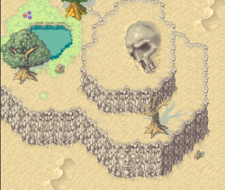

- Chapter 2: { terrain: Oasis, enemy: Bomber }

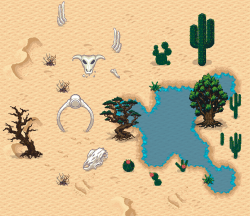

- Chapter 3: { terrain: Swamp, enemy: Chaser }

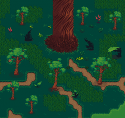

- Chapter 4: { terrain: Forest, enemy: Attack Helicopter }

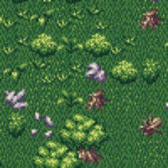

- Chapter 5: { terrain: River, enemy: Attack Airplane }

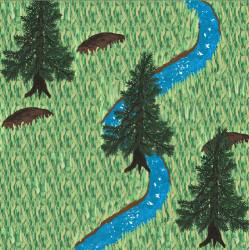

- Chapter 6: { terrain: Warzone, enemy: Multirole }

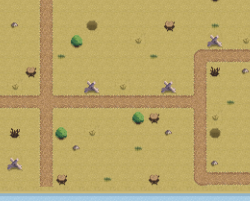

## Enemy

This is the description of each type of enemy's features:

- Fighter: Shoots single missiles down.

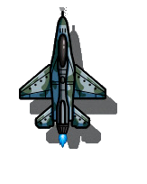

- Bomber: Shoots single bombs down.

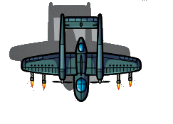

- Chaser: Chases the player's plane and self-destructs.

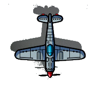

- Attack Helicopter: Shoots double missiles down.

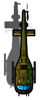

- Attack Airplane: Shoots single missiles down at a high speed.

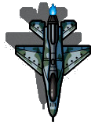

- Multirole: Moves slowly but shoots missiles down and diagonally.

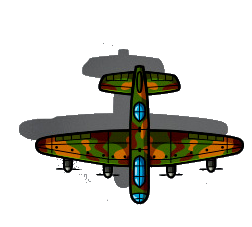

## Bosses

Each boss will behave differently:

- Chapter 1: Boss will shoot missiles down and diagonally, needs 25 hits to be destroyed.

- Chapter 2: Boss will shoot double missiles down with bombs, needs 35 hits to be destroyed.

- Chapter 3: Boss will shoot chasing missiles at the player, needs 45 hits to be destroyed.

- Chapter 4: Boss will shoot triple missiles down at a high speed, needs 55 hits to be destroyed.

- Chapter 5: Boss will shoot triple chasing missiles, needs 65 hits to be destroyed.

- Chapter 6: Boss will shoot triple chasing missiles with bombs, needs 80 hits to be destroyed.

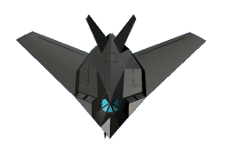

## Attacks

There are two types of attacks, missiles and bombs, the player takes one damage from each hit:

- Missiles: The area is small.

- Bombs: The area is big.

## Bonuses

At the end of each stage, the player will be able to choose one out of two random bonuses for the next stage:

- Increase move speed
- Add one more vertical missile (up to 3)
- Increase attack speed

# Developer's Notes

This project was developed in these stages:

- Stage 1: Learning how to use Phaser 3, following tutorials and how to setup a game's structure built with Javascript (1 day).
- Stage 2: Building this GDD (0.5 day).
- Stage 3: Creating the project's codes organizational structure (0.5 day).
- Stage 4: Creating the project's scenes (1 day)
- Stage 5: Creating the project's classes and tests (1 day).
- Stage 6: Testing the gameplay, fixing bugs and deployment (1 day).

# Making Of

This project was built using [Phaser 3](https://phaser.io/phaser3), [Webpack](https://webpack.js.org/) and Javascript.

# Acknowledgements

- Big thanks to [Ikraam Ghoor](https://github.com/ikraamg), who helped me building this story's introduction.

- This project was built during my course at [Microverse](https://www.microverse.org/), which is an amazing school where I learned how to program. Also, Microverse provided me with an [API](https://www.notion.so/Leaderboard-API-service-24c0c3c116974ac49488d4eb0267ade3) to keep the player's scores.

- Thanks to the following TSEs who reviewed my project:

  - [Louis Chia](https://github.com/shloch)
  - [Sérgio Torres](https://github.com/Torres-ssf)
  - [James Okunlade](https://github.com/JamesOkunlade)

- Thanks to [OpenGameArt](https://opengameart.org/) for providing the free assets I used in this game. The full list of authors is bellow:

  - Airplanes: [Spring](https://opengameart.org/users/spring)
  - Helicopter: [morgan3D](https://opengameart.org/users/morgan3d)
  - Boss Planes: [MNDV.ecb](https://opengameart.org/users/mndvecb)
  - Bombs: [MSavioti](https://opengameart.org/users/msavioti)
  - Missiles: [samoliver](https://opengameart.org/users/samoliver)
  - Explosions: [den_yes](https://opengameart.org/users/denyes)
  - Desert: [Leonard pabin](https://opengameart.org/users/leonard-pabin)
  - Oasis and Swamp: [bluecarrot16](https://opengameart.org/users/bluecarrot16)
  - Forest: [surt](https://opengameart.org/users/surt)
  - River: [bernhard1020](https://opengameart.org/users/bernhard1020)
  - Warzone: [Canvas Digital Studios](https://opengameart.org/users/canvas-digital-studios)
  - Main menu song: [synicmusic](https://opengameart.org/users/cynicmusic)
  - Checkboxes: [Atrus](https://opengameart.org/users/atrus)
  - Desert song: [yd](https://opengameart.org/users/yd)
  - Forest song: [mrpoly](https://opengameart.org/users/mrpoly)
  - Oasis song: [bart](https://opengameart.org/users/bart)
  - Swamp, River and Warzone songs: [Matthew Pablo](https://opengameart.org/users/matthew-pablo)
  - Explosion sound: [Joth](https://opengameart.org/users/joth)
  - Shoots sound: [Stephen M. Cameron](http://sourceforge.net/users/smcameron)